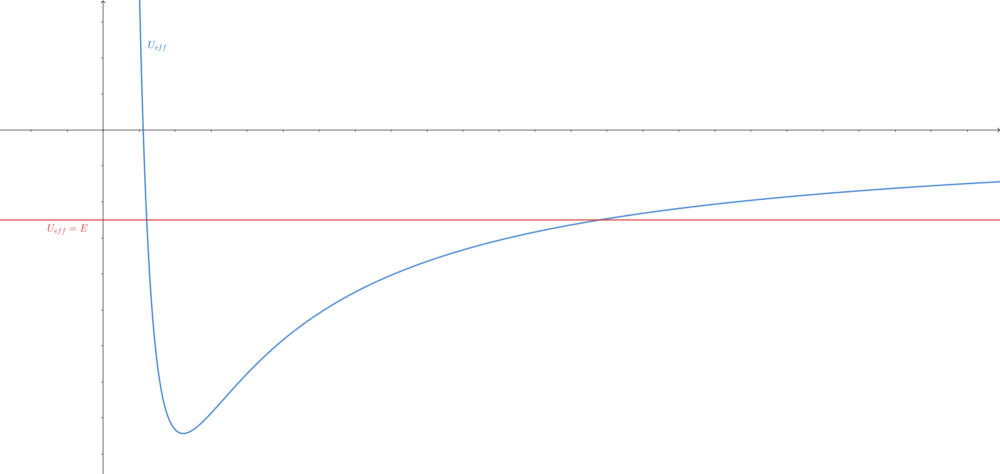

Assuming that a gravitational force acts on a material point (oriented towards the origin of coordinate system, inversely proportional to the square of the distance), the acceleration of the material point is given by:

$$\begin{equation*}
\frac{d^{2}\vec{r}}{dt^{2}} = -G\frac{M}{r^{2}}\hat{r}
\end{equation*}$$

where $M$ is the mass of the body fixed at the coordinate origin.
Right-hand side can be written as a gradient:

$$\begin{align*}\hat{r} &= \nabla r\\
-G\frac{M}{r^{2}}\hat{r} &= \nabla \left(\frac{GM}{r}\right)\end{align*}$$

If we project the above equation onto the direction of the tangent and multiply it by the velocity (effectively taking a dot product of both sides with the velocity vector), we get:

$$\begin{align*}\frac{d^{2}\vec{r}}{dt^{2}}\cdot \frac{d\vec{r}}{dt} &= \nabla \left(\frac{GM}{r}\right)\cdot \frac{d\vec{r}}{dt}\\
\frac{d}{dt}\left(\frac{1}{2}\left(\frac{d\vec{r}}{dt}\cdot \frac{d\vec{r}}{dt}\right) \right) &= \frac{d}{dt}\left(\frac{GM}{r}\right)\\
\frac{v^{2}}{2}-\frac{GM}{r} &= \text{const.}\end{align*}$$

This represents the conservation of energy.
On the other hand, if we take a vector product of the above equation with the position vector, the right-hand side of the equation is zero, and we get:

$$\begin{align*}\vec{r}\times\frac{d^{2}\vec{r}}{dt^{2}} &= -\vec{r}\times G\frac{M}{r^{2}}\hat{r}\\
\frac{d}{dt}\left(\vec{r}\times \frac{d\vec{r}}{dt}\right)-\frac{d\vec{r}}{dt}\times \frac{d\vec{r}}{dt} &= 0\\
\vec{r}\times \frac{d\vec{r}}{dt} &= \text{const.}\end{align*}$$

This is the conservation of angular momentum. Since we only used the fact that the force field is central to cancel out the right-hand side, this result holds for all central fields, including those that do not follow Newtonian form. From this, we can conclude that during the motion, the material point remains in a plane whose normal is represented by the angular momentum vector. If we now introduce a cylindrical coordinate system whose $z$-axis coincides with the normal to the plane of motion, the above equation becomes:

$$\begin{align*}r\hat{r}\times \left(\dot{r}\hat{r}+r\dot{\theta}\hat{\theta}\right) &= h\hat{z} \\r^{2}\dot{\theta} &= h\end{align*}$$

The product of the square of the distance and the angular velocity, which represents both double sectorial velocity and the moment of momentum, is constant during motion. The law of conservation of energy in cylindrical coordinates is:

$$\begin{equation*}
\frac{1}{2}\left(\dot{r}^{2}+r^{2}\dot{\theta}^{2}\right)-\frac{GM}{r} = E
\end{equation*}$$

Using the law of conservation of momentum, we can eliminate the angular velocity from the equation, so we get:

$$\begin{equation*}
\frac{\dot{r}^{2}}{2} + \underbrace{\frac{h^{2}}{2r^{2}}-\frac{GM}{r}}_{U_{eff}} = E
\end{equation*}$$

This reduces the problem to a one-dimensional problem with a different potential energy function(see figure). The energy of the material point determines the limits of its motion.

To study the geometry of motion, it is necessary to eliminate time from the equations (i.e. derivatives with respect to time). The radial velocity can be written as:

$$\dot{r}=\frac{dr}{d\theta}\dot{\theta}$$

This is not possible only when the angular velocity is zero, but then the trajectory is trivial - a straight line connecting the material point and the center.

Substituting in the conservation of energy equation, we get:

$$\begin{align*}\frac{1}{2}\left(\left(\frac{dr}{d\theta}\right)^{2}+r^{2}\right)\frac{h^{2}}{r^{4}}-\frac{GM}{r} &= E \\
\frac{h^{2}}{2}\left(\left(\frac{1}{r^{2}}\frac{dr}{d\theta}\right)^{2}+\frac{1}{r^{2}}\right)-\frac{GM}{r} &= E \\
\frac{h^{2}}{2}\left ( \left ( \frac{d}{d\theta}\frac{1}{r} \right )^{2}+\frac{1}{r^{2}} \right )-\frac{GM}{r} &= E\end{align*}$$

The last equation provides us with a reason to consider the reciprocal value of the distance and introduce:

$$\begin{equation*}
\rho = \frac{1}{r}
\end{equation*}$$

and the equation becomes:

$$\begin{align*}\frac{h^{2}}{2}\left(\left(\frac{d\rho}{d\theta}\right)^{2}+\rho^{2}\right)-GM\rho &= E \\
\left(\frac{d\rho}{d\theta}\right)^{2}+\rho^{2}-2\frac{GM}{h^{2}}\rho &= \frac{2E}{h^{2}} \\
\left(\frac{d\rho}{d\theta}\right)^{2}+\left(\rho-\frac{GM}{h^{2}}\right)^{2} &= \frac{1}{h^{2}}\left(2E+\frac{G^{2}M^{2}}{h^{2}}\right)\end{align*}$$

The last equation represents a circle in the coordinate system $\left(\rho, d\rho/d\theta\right)$ with a center at point $\left(GM/h^{2}, 0\right)$. If we put:

$$\begin{equation*}
\rho-\frac{GM}{h^{2}} = \frac{1}{h}\sqrt{2E+\frac{G^{2}M^{2}}{h^{2}}}\cos{\theta}
\end{equation*}$$

then it follows:

$$\begin{equation*}
\frac{d\rho}{d\theta} = -\frac{1}{h}\sqrt{2E+\frac{G^{2}M^{2}}{h^{2}}}\sin{\theta}
\end{equation*}$$

and the above equation is indeed satisfied. Therefore, one of the possible solutions is:

$$\begin{align*} \rho&=\frac{GM}{h^{2}} + \frac{1}{h}\sqrt{2E+\frac{G^{2}M^{2}}{h^{2}}}\cos{\theta} \\\frac{1}{r} &= \frac{1+\sqrt{\frac{2Eh^{2}}{G^{2}M^{2}}+1}\cos{\theta}}{\frac{h^{2}}{GM}}\end{align*}$$

This is the equation of a conic section (see [this post](/posts/ellipse)). We can read off its eccentricity from it:

$$\begin{equation*}
e = \sqrt{\frac{2Eh^{2}}{G^{2}M^{2}}+1}
\end{equation*}$$

And indeed, the fraction inside the square root is a dimensionless quantity (all units cancel out). When the energy of the particle is less than zero, the eccentricity is less than one, so the path is an ellipse. When the energy is equal to zero, the path is a parabola, while in the opposite case, it is a hyperbola. In each of these cases, one of the foci lies at the origin of the coordinate system. The length of the longer semiaxis can also be calculated using the well-known expression for an ellipse:

$$\begin{align*}a(1-e^{2}) &= \frac{h^{2}}{GM} \\-a\frac{2Eh^{2}}{G^{2}M^{2}} &= \frac{h^{2}}{GM} \\a &= -\frac{GM}{2E}\end{align*}$$

Recall that we have established that sectorial velocity is a constant, so the period of revolution can be calculated by dividing the area of the ellipse by this value. We obtain:

$$\begin{align*}
T &= \frac{2\pi ab}{h} \\
T &= \frac{2\pi a^{2}\sqrt{1-e^2}}{h}\\
T &= \frac{2\pi a}{h} \sqrt{\frac{ah^{2}}{GM}} \\
T &= 2\pi \sqrt{\frac{a^{3}}{GM}}
\end{align*}$$

## Mechanical similarity
Let us continue with our analysis of Kepler's problem, i.e. the motion of a material point in a central force field whose intensity is inversely proportional to the square of the distance:

$$\begin{equation*}

\frac{d^{2}\vec{r}}{dt^{2}} = -G\frac{M}{r^{2}}\hat{r}

\end{equation*}$$

As we have seen, this law leads (in certain cases) to a path in the shape of an ellipse. Let there be a trajectory for which the length of the major axis is $a$ meters, and the period of a complete circle is $T$ seconds. If we were to use other units, such that $a$ and $T$ of old units correspond to $\alpha a$ and $\beta T$ of new units, respectively, the above law would become:

$$\begin{equation*}

\alpha \frac{d^{2}\vec{r}}{\beta^{2}dt^{2}} = -G\frac{M}{\alpha^{2} r^{2}}\hat{r}

\end{equation*}$$

Only if:

$$\begin{align*}\frac{\alpha}{\beta^{2}} &= \frac{1}{\alpha^{2}}  \\

\alpha^{3} &= \beta^{2}\end{align*}$$

would the law retain the same form as in natural units[^1]. This means that the same numerical solutions would hold for units selected in this way. Therefore, there would also exist a trajectory for which the length of the major axis would be $a$ of the new spatial units, and the period of a complete circle would be $T$ of the new temporal units. In standard units, these values would be $a/\alpha$ and $T/\beta$, respectively, or when the substitution $\beta = \alpha^{3/2}$ is introduced, we obtain pairs of values:

$$\begin{equation*}

\frac{a}{\alpha},\frac{T}{\alpha^{3/2}}

\end{equation*}$$

Since $\alpha$ is arbitrary (it is only important to determine the corresponding $\beta$ that does not change the equations of motion), we can infer the relationship between the period and the length of the major axis - namely the one suggested by the third Kepler's law.

To provide a rather silly example, say that Earth completes its revolution around the Sun in 1 second tracing an ellipse with major-semiaxis of length 1 meter. It turns out that the governing equation of motion remains unchanged if we instead decide to measure distance and time in centimeters and milliseconds, respectively. Thus, they "allow" existence of another planet which goes around the Sun in 1 ms along the ellipse with major semi-axis of lenght 1 cm.

[^1]: Note that the numerical value of the gravitational constant depends on the units used.