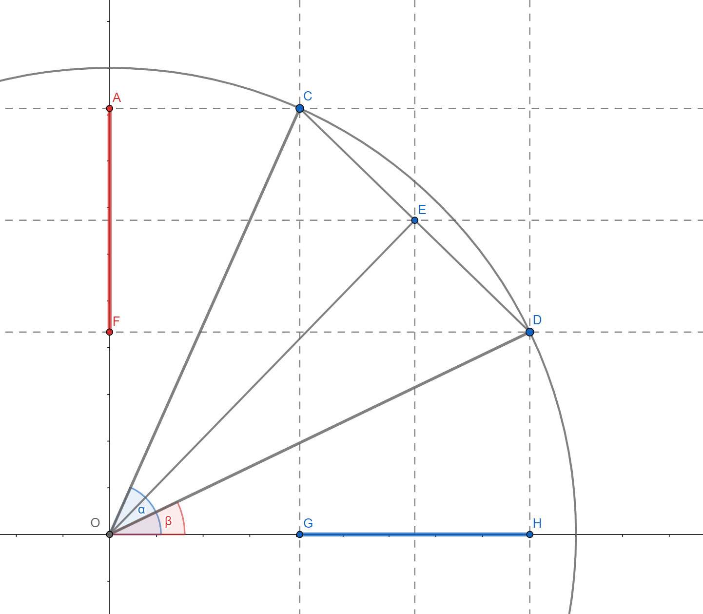

## Review of trigonometric identities

Let's start by deriving a couple of trigonometric identities that will be of crucial use to us. The most beautiful thing about trigonometry is that everything can be reduced to triangles and simple Euclidean geometry. Let's first consider the mean value of the cosine of two angles:

$$\frac{\cos{\alpha}+\cos{\beta}}{2}$$

It can be seen from the picture that the required value is given by the length of $OF$, that is, by the projection of the length of $OE$ on the x-axis. The point $E$, according to Thales' theorem, is located halfway along the length $CD$. Since both $C$ and $D$ are on the unit circle, it is an isosceles triangle $\Delta OCD$, which implies that the angle $\measuredangle OED$ is right, as well as that along $OE$ the poles of the angle $\measuredangle COD$ . It follows:

$$\overline{OE} = \cos{\frac{\alpha-\beta}{2}},$$

and finally:

$$\frac{\cos{\alpha}+\cos{\beta}}{2} = \cos{\frac{\alpha-\beta}{2}}\cos{\frac{\alpha+\beta} {2}}$$

This is a well-known formula for converting a sum to a product, and although it is shown using the example of the angles of the first quadrant, it is valid for all angles, which is relatively easy to demonstrate. Analogously, the mean value of the sines of two angles is:

$$\frac{\sin{\alpha}+\sin{\beta}}{2} = \cos{\frac{\alpha-\beta}{2}}\sin{\frac{\alpha+\beta} {2}}$$

Let us now consider the difference of cosines of two angles:

$$\cos{\alpha}-\cos{\beta}$$

It can be seen from the picture that it is a length of length $GH$, with a negative sign in front, and it is concluded that it is a projection of length $CE$ on the h-axis. Since $CE$ is the base of an isosceles triangle with the vertex angle $\alpha-\beta$ and legs of length one, it is easy to calculate:

$$\overline{OE} = 2\sin{\frac{\alpha-\beta}{2}}$$

Further, looking at the triangle $\Delta CEO$ it can be found that:

$$\measuredangle OCE = \frac{\alpha+\beta}{2}$$

whence follows:

$$\begin{align*}

     \cos{\alpha}-\cos{\beta} &= -2\sin{\frac{\alpha-\beta}{2}}\sin{\frac{\alpha+\beta}{2}} \\ &= 2\sin{\frac{\beta-\alpha}{2}}\sin{\frac{\alpha+\beta}{2}}

\end{align*}$$

And similarly:

$$\sin{\alpha}-\sin{\beta} = 2\sin{\frac{\alpha-\beta}{2}}\cos{\frac{\alpha+\beta}{2}}$$

It should be noted that the last formula could be obtained from the sum formula if the sign of $\beta$ were changed. For further work, we will actually need a slightly different form of the previous formulas - the transformation of the product into the sum. With shifts:

$$\begin{align*}

     x &= \frac{\alpha+\beta}{2} \\

     y &= \frac{\alpha-\beta}{2}

\end{align*}$$

the identities are obtained:

$$\begin{align*}

     \cos{x}\cos{y} &= \frac{\cos{\left ( x + y \right )}+\cos{\left ( x - y \right )}}{2} \\ \sin {x}\cos{y} &= \frac{\sin{\left ( x + y \right )}+\sin{\left ( x - y \right )}}{2} \\ \sin{x }\sin{y} &= -\frac{\cos{\left ( x + y \right )}-\cos{\left ( x - y \right )}}{2}

\end{align*}$$

## Fourier series

Our interest shifts to periodic functions - functions for which $f(t) = f(t+T)$ holds for every $t$. The smallest non-negative number $T$ for which this equality holds is called the period of the function. The most famous periodic functions are certainly trigonometric functions - sine and cosine above all. The question arises whether it is possible to represent an arbitrary periodic function, such as the one in the picture below, as a weighted sum of sines and cosines.

Let's assume it's possible. It is obvious that in that case only sine and cosine functions with a period that is an integer part of $T$ could participate in the sum. The circular frequency corresponding to the period $T/n$ is:

$$\omega_{n} = \frac{2\pi n}{T}$$

Therefore, according to our assumption, it is possible to write:

$$f(t) = \frac{A_{0}}{2} + \sum_{n = 1}^{\infty} A_{n}\cos{\omega_{n}t} + B_{n} \sin{\omega_{n}t}$$

This form is called the Fourier series. The basic problem consists in determining the coefficients $A_{n}$ and $B_{n}$. For this purpose, the specificity of integrating the product of sine and cosine along one period is used. Let's look at the integral first:

$$\begin{align*}&\int_{-T/2}^{T/2}\cos{\left ( \frac{2\pi it}{T} \right )}\cos{\left ( \frac {2\pi jt}{T} \right )}\, dt \\ \frac{1}{2}&\int_{-T/2}^{T/2} \left [ \cos{\left ( \frac{2\pi (i+j)t}{T} \right )}+\cos{\left ( \frac{2\pi (i-j)t}{T} \right )}\right ]\, dt\end{align*}$$

for positive numbers $i,\,j$.

When $i = j$, the integral is equal to $T/2$, otherwise it is equal to 0. The integral behaves in the same way:

$$\int_{-T/2}^{T/2}\sin{\left ( \frac{2\pi it}{T} \right )}\sin{\left ( \frac{2\pi jt }{T} \right )}\, dt,$$

while for each $i, j$ the following applies:

$$\int_{-T/2}^{T/2}\sin{\left ( \frac{2\pi it}{T} \right )}\cos{\left ( \frac{2\pi jt }{T} \right )}\, dt = 0.$$

If we integrate an arbitrary periodic function multiplied by a cosine function of circular frequency $\omega_{n}$ on the same interval, using the previous results we get:

$$\begin{align*} &\int_{-T/2}^{T/2}f(t)\cos{\omega_{n}t}\,dt \\ =&\int_{-T/2} ^{T/2}\left ( \frac{A_{0}}{2} + \sum_{k=1}^{\infty}A_{k}\cos{\omega_{k}t} + B_{ k}\sin{\omega_{k}t}\right )\cos{\omega_{n}t} \\=&\frac{A_{0}}{2}\int_{-T/2}^{ T/2}\cos{\omega_{n}t}\,dt \\ &+ \sum_{k = 1}^{n}\left [A_{k}\int_{-T/2}^{T /2}\cos{\omega_{k}t}\cos{\omega_{n}t}\,dt+B_{k}\int_{-T/2}^{T/2}\sin{\omega_ {k}t}\cos{\omega_{n}t}\,dt\right] \\ =&\frac{A_{n}T}{2}.\end{align*}$$

The same is true in the case of the sine function. Integration operations defined in this way, therefore, cancel all components of the Fourier series up to one. Hence, we conclude that the following formulas are valid:

$$\begin{align*}A_{n} &= \frac{2}{T}\int_{-T/2}^{T/2}f(t)\cos{\omega_{n}t}\, dt, \\ B_{n} &= \frac{2}{T}\int_{-T/2}^{T/2}f(t)\sin{\omega_{n}t}\,dt. \end{align*}$$

With this, the problem was solved - the weights corresponding to different frequencies were found, that is, the spectrum of the periodic function was determined. For the purpose of testing and studying the spectrum of different periodic functions, a simple program can be written using the methods of numerical integration.

As we have moved into the field of analysis, it would be ideal to move to exponential functions which are much easier to maneuver and we will do so with a heavy heart. Using the formulas:

$$\begin{align*}\cos{x} &= \frac{e^{ix}+e^{-ix}}{2} \\ \sin{x} &= \frac{e^{ix}- e^{-ix}}{2i}\end{align*}$$

We will write the Fourier series as:

$$\begin{align*}f(t) &= \frac{A_{0}}{2} + \sum_{n = 1}^{\infty} A_{n}\frac{e^{i\omega_{ n}t}+e^{-i\omega_{n}t}}{2} + B_{n}\frac{e^{i\omega_{n}t}-e^{-i\omega_{n }t}}{2i} \\ &= \frac{A_{0}}{2} + \sum_{n = 1}^{\infty}\left [ \frac{A_{n} - iB_{n} }{2} e^{i\omega_{n}t} + \frac{A_{n} + iB_{n}}{2} e^{-i\omega_{n}t}\right] \\ & = \sum_{n = -\infty}^{\infty}C_{n}e^{i\omega_{n}t},\end{align*}$$

where $C_{n} = \left(A_{n}-iB_{n}\right)/2$ and $\overline{C_{n}} = C_{-n}$. The coefficients of $C$ are, in general, complex numbers which, in the case of real functions, come in conjugate complex pairs. This way of notation allows the generalization of Fourier series of functions of a complex variable. It remains to transfer the formulas for determining the spectrum to this form:

$$\begin{align*}C_{n} &= \frac{A_{n} - iB_{n}}{2} \\&= \frac{1}{T}\int_{-T/2}^{ T/2}f(t)\left ( \cos{\omega_{n}t} \ -i\sin{\omega_{n}t}\right )\,dt \\ &= \frac{1}{ T}\int_{-T/2}^{T/2}f(t)e^{-i\omega_{n}t}\,dt\end{align*}$$

Often, the frequency is taken instead of the circular frequency This ends the story about Fourier series. Things are just about to get nasty. Hold tight!

## Fourier transform

The Fourier transform can be seen as a formula for determining the spectrum of arbitrary functions, including non-periodic ones, relying on the assumption that non-periodic functions can be represented as the limit value of periodic ones with a period tending to infinity. Given that frequency and period are inversely proportional, it is true that the fundamental frequency tends to zero. This means that the spectrum will become more and more dense with the growth of the period and in the limiting case it will tend towards the continuum (although it will never really be a continuum just as the infinitesimal never reaches zero, the essence is a limiting process). Accordingly, from now on we will talk about the spectral density so that the infinitesimal frequency interval around $\omega$ has the weight $\hat{f}_{\omega}(\omega)d\omega$. Therefore, converting the sum into a Riemann integral, we write the function as:

$$f(t) = \int_{-\infty}^{\infty}\hat{f}_{\omega}(\omega)e^{i\omega t}d\omega$$

This is the inverse Fourier transform - it regenerates the function from the spectrum. The Fourier transform works in reverse - it determines the spectrum based on the function - and is a modification of the already mentioned expression for the coefficients of the Fourier series when the period tends to infinity:

$$\hat{f}_{\omega}(\omega) = \frac{1}{2\pi}\int_{-\infty}^{\infty}f(t)e^{-i\omega t}dt$$

Notice how we used the fact that $\lim_{T\to\infty} 2\pi/T = d\omega$ and then switched to the density function $\hat{f}_{\omega}(\omega)$. However, the most popular convention is that the Fourier transform implies the frequency density $\xi$ instead of the circular frequency density $\omega$. Of course, the difference is only in the factor $2\pi$, i.e. the following formulas hold true:

$$\begin{align*} f(t) &= \int_{-\infty}^{\infty}\hat{f}(\xi)e^{i2\pi\xi t}d\xi \\ \hat {f}(\xi) &= \int_{-\infty}^{\infty}f(t)e^{-i2\pi\xi t}dt \end{align*}$$

Note that the first formula has not changed because $\hat{f}(\xi)d\xi = \hat{f}_{\omega}(\omega)d\omega$ holds. The advantage of this notation is that it is symmetric and therefore easier to remember[^1].

In general, the good thing about this way of defining the Fourier transform is the ease with which the formulas can be derived because they follow as a natural generalization of the formulas we encountered with Fourier series. This also bypasses awkward integrals and complex mathematical arguments. As long as we take into account the process of transition from the discrete to the continuous domain, there are no problems.

## Brief Review

It is a good moment to pause and comment on previous research. In the previous sections, we showed how it is possible to represent an arbitrary function[^2] by a unique superposition of simple periodic functions - sines and cosines. Let's try to make an analogy with geometric vectors. Each vector can be represented as a linear combination of base vectors. In the case of periodic functions, for example, that basis consists of sines and cosines of precisely determined frequencies - there are infinitely many of them, of course, but countably many. In the case of geometric vectors, we obtain the components of the vector by the scalar product, which is defined as the product of the length of the vector and the cosine of the angle between them. In our case, the components are obtained by a somewhat more complex procedure - integration. Actually, the structure we built should correspond to what mathematicians call a unitary vector space.

One of the advantages of the Fourier transform, that is, the representation of functions by the sum of simple periodic functions, is that the latter are suitable for solving various problems. Differential equations are one obvious example; Fourier himself "invented" Fourier series to find solutions to the heat equation. Here is a closer example. In the first year of electrical engineering, we studied the basics of electrical circuits and the concept of impedance was key. Impedance is, of course, unlike resistance, inductance and capacitance, which are physical terms, a purely mathematical construct that is useful in the case of periodic excitation, i.e. of alternating current and voltage sources with sinusoidal dependence on time. In that case, the differential equations describing the dynamics of the circuit can be reduced to algebraic equations over complex numbers and easily solved. In electrical engineering, especially power engineering, one often works with simple periodic excitation, so this technique is certainly useful. On the other hand, in the case of an arbitrary periodic or aperiodic signal, the Fourier transform can be useful to us. The strategy consists in representing the original signal with sines and cosines, then finding a solution for each of the frequencies, and later superimposing where each solution participates with the appropriate weight.

Another well-known example is the characteristic function in probability theory, which is defined as:

$$\varphi_{X}(t) = \mathbb{E}\left [ e^{itX} \right ]$$

which for continuous random variables reduces to:

$$\varphi_{X}(t) = \int_{-\infty}^{\infty}f_{X}(x)e^{itx}\,dx$$

Due to a somewhat unfortunate definition, the characteristic function can be viewed as either a Fourier transform or an inverse Fourier transform. In the modest part of the literature that I have read, this first point of view is generally taken. In my opinion, the justification for such a choice can be found in the fact that the distribution density function is real and can be viewed as a signal. On the other hand, the advantage of the second point of view lies in the fact that the nature of the distribution density function corresponds to the nature of the Fourier transform - in both cases, we are talking about densities of some measure. In that case, the signal that is obtained as a reconstruction is complex, except for the distribution density functions which are symmetrical around zero. Be that as it may, it is known that working with the characteristic function is often much easier than with the distribution density function itself.

## Discrete Fourier Transform

It is time to go over the discrete domain as well - we will no longer talk about continuous signals (functions), but we will deal with sequences of values. These strings can be created as a consequence of sampling a continuous signal. We, having so far become inclined to see and look for simple periodic signals in everything, will try the same this time. Let's start with a sequence $x_{n}$ of period $N$ ($x_{n} = x_{n+N}$) and assume that it can be written as:

$$\begin{align*}x_{n} &= \frac{A_{0}}{2} + \sum_{k=1}^{\left \lfloor \frac{N}{2} \right \rfloor} A_{k}\cos{\omega_{k}n}+B_{k}\sin{\omega_{k}n} \\ &= \sum_{k=-\left \lfloor \frac{N}{2 } \right \rfloor}^{\left \lfloor \frac{N}{2} \right \rfloor}C_{k}e^{i\omega_{k}n}\end{align*}$$

where among the coefficients $A_{k},B_{k},C_{k}$ already known relations apply, while $\omega_{k} = \frac{2\pi k}{N}$. The question arises why the highest frequency we allow is $\omega_{\left \lfloor \frac{N}{2} \right \rfloor}$ and not $\omega_{N-1}$. Assume that the sum can contain summands corresponding to the frequency $\omega_{k}$ for $k > \frac{N}{2}$; the sum would also contain summands corresponding to the frequency $\omega_{N-k}$ and $\cos{\omega_{k}n}=\cos{\omega_{N-k}n}$ would hold as well as $\sin{\omega_{ k}n}=-\sin{\omega_{N-k}n}$. If we look only at the summands mentioned, we would have:

$$\begin{align*}

     &A_{N-k}\cos{\omega_{N-k}n}+A_{k}\cos{\omega_{N-k}n}+B_{N-k}\sin{\omega_{N-k}n}-B_{k}\sin{\omega_{ N-k}n} \\ &=\left(A_{N-k}+A_{k}\right)\cos{\omega_{N-k}n} + \left(B_{N-k}-B_{k}\right)\sin{\omega_{N-k}n}

\end{align*}$$

From here it is obvious that it is sufficient to include only the frequency $\omega_{N-k}$ in the sum. This result can further be used to derive Shannon's sampling theorem. In the literature, the equivalent form of the sum, where the indices go from 0 to $N-1$, is more present:

$$\begin{equation}

     x_{n} = \sum_{k=0}^{N-1}C_{k}e^{i\omega_{k}n}

\end{equation}$$

It should be emphasized here that in the case of even $N$, $C_{N/2} = A_{N/2}$ applies instead of the standard expression.

The coefficients $C_{k}$ are obtained by a similar procedure, relying on essentially the same properties that we have already mentioned, but it is not out of place to repeat:

$$\begin{align*}&\sum_{n=0}^{N-1}e^{iw_{j}n}e^{-i\omega_{k}n} \\ =&\sum_{n= 0}^{N-1}e^{i\frac{2\pi}{N}(j-k)n} \\=& \left\{\begin{matrix}

N, & i=j \\

\frac{e^{i2\pi(j-k)}-1}{e^{i2\pi(j-k)/N}-1}=0, & i\neq j \\

\end{matrix}\right.\end{align*}$$

along the way using the sum of the geometric progression. Based on this, the formula for determining the coefficients reads:

$$C_{k} = \frac{1}{N}\sum_{n=0}^{N-1}x_{n}e^{-i\omega_{k}n}$$

In the literature, we most often find the quantity $X_{k} = NC_{k}$ (which corresponds to the density of weights) and then the formulas read:

$$\begin{align*} x_{n} &= \frac{1}{N}\sum_{k=0}^{N-1}X_{k}e^{i\omega_{k}n} \\ X_{n} &= \sum_{n=0}^{N-1}x_{n}e^{-i\omega_{k}n}\end{align*}$$

The preceding considerations are related to what is abbreviated as DTFS *Discrete Time Fourier Series*. The Discrete Fourier Transform (DFT) is formally defined for a finite series as the DTFS for a corresponding periodic series. On the other hand, the Discrete Cosine Transform (DCT) for a finite series, it is generally defined as the DTFS of the even expansion of that series (there are 4 variants of the expansion that draw different formulas for the calculation).The even expansion is considered better than the periodic expansion in some applications because with the latter at the boundary between two periods sudden jumps may occur that lead to a wider spectrum (a larger number of frequencies is needed to faithfully describe the signal).

## Fourier transform in 2D

Let us now turn our attention to the two-dimensional function $f(x,y)$ where $x,y$ are the coordinates of the Cartesian coordinate system defined on a square with the center at the coordinate origin and the edges parallel to the coordinate axes. Protoperiodic functions in 2D, apart from the frequency, also have the property of the propagation direction (along one of the axes or a line between them). Let the vector that determines the direction of propagation of sinusoidal waves be determined by the angle $\theta$ that coincides with the positive direction of the x-axis, i.e. the unit vector $(\cos{\theta}, \sin{\theta})$, and the frequency by $\xi$. Then the wave, let's say a sinusoid, along that direction is analytically written as:

$$\begin{align*}

     &\sin{2\pi\xi\left(x\cos{\theta}+y\sin{\theta}\right)} = \\

     &\sin{2\pi\left(ux+vy\right)}

\end{align*}$$

where $u=\xi \cos{\theta},\,v=\xi\sin{\theta}$.

The expression in parentheses in the first row represents the projection of the position vector onto the direction determined by the angle $\theta$, and the equation itself $x\cos{\theta}+y\sin{\theta} = \text{const.}$ represents the equation of the wave front .

On this occasion, we will deal with a discrete case that finds application in digital image processing. If the square is $M\times N$ in size (let's say an image of that resolution), we are looking for the following representation:

$$f(x,y) = \frac{1}{MN}\sum_{u}\sum_{v}X_{u,v}e^{i2\pi\left ( \frac{ux}{M} +\frac{vy}{N} \right )},$$

with ranges $u = 0, \cdots, M-1$ and $v = 0, \cdots, N-1$. The coefficients $X_{u,v}$ are obtained according to an already known scheme (the reader is encouraged to derive the formula for himself):

$$X_{u,v} = \sum_{x}\sum_{y}f(u,v)e^{-i2\pi\left ( \frac{ux}{M}+\frac{vy}{ N} \right )}$$

which represents the Fourier transform in two dimensions.

## Digital Filters

It is often necessary to remove a part of the spectrum from a signal, and filters are used for this purpose. Before we say something about them, let's show how multiplication in the frequency domain is equivalent to convolution in the time or space domain (whichever definition makes more sense in the specific application), i.e. let's show that the inverse Fourier transform of the product is equal to the convolution of the original signals:

$$\begin{align*}

     &\sum_{k}C_{k}'C_{k}''e^{i\omega_{k}n} \\ = &\sum_{k}C_{k}'\left(\frac{1} {N}\sum_{l}x''_{l}e^{-i\omega_{k}l}\right)e^{i\omega_{k}n} \\ =

     &\frac{1}{N}\sum_{l}x''_{l}\left(\sum_{k}C_{k}'e^{i\omega_{k}(n-l)}\right) \\ =

     &\frac{1}{N}\sum_{l}x''_{l}x'_{n-l}

\end{align*}$$

We have chosen a one-dimensional discrete domain to derive this result, although it holds in both the continuous and multidimensional cases.

Low-pass filters, for example, as their name suggests, retain low frequencies while attenuating high frequencies. The most intuitive way to achieve this is only to cut off frequencies higher than a certain limit, which means that the Fourier transform is multiplied by the so-called by a rectangular function defined as:

$$\Pi_{\omega}(x) = \left\{\begin{matrix}

0 & |x|>\omega \\

\frac{1}{2} & |x|=\omega\\

1 & |x|<\omega\\

\end{matrix}\right.$$

Since multiplication in the frequency domain corresponds to convolution in the time domain, it means that the convolution of the original signal and the inverse Fourier transform of the rectangular function, which is the $\text{sinc}$ function, should be performed. However, this is quite difficult in practice, which is easy to see from the graph.

Actually, it's often the other way around - the convolution is done with a rectangular function (the popular box), which means the spectrum is multiplied by a $\text{sinc}$ function - that's a mean filter. Its flaws can be seen from its spectrum: some higher frequencies will be less damped than some lower ones, some frequencies will have a phase shift of $180^{\circ}$ corresponding to negative values.

Another frequently encountered filter is the Gaussian filter, which in the frequency domain has the form of a normal distribution, or Gaussian. What's interesting is that the Fourier transform of the Gaussian is Gaussian again (it's one of those nice analytical properties of the normal distribution) so the convolution of the original signal is also Gaussian. The rule is that the widths (read standard deviations) of those two Gaussians are inversely proportional, so the smaller the range of frequencies we want to keep, the more weight the surrounding points would have when filtering, which makes sense intuitively.

[^1]: In the literature, including Wikipedia, one finds a formula containing $2\pi$ in the expression for the inverse Fourier transform. In that case, $\hat{f}_{\omega}$ and $\hat{f}$ are identical functions, but the meaning of the density for the circular frequency is lost. Normally, I use my own notation.

[^2]: This is not entirely correct, but for all intents and purposes, it is.