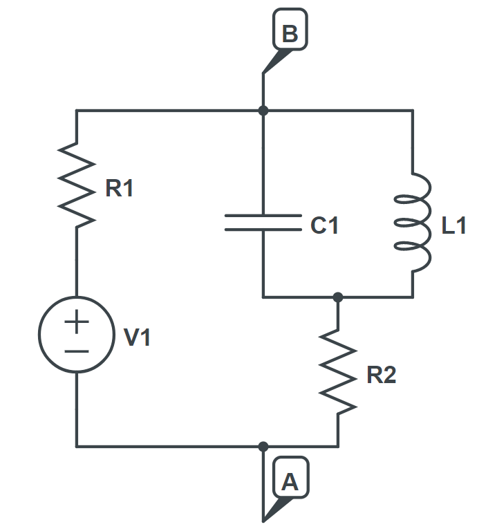
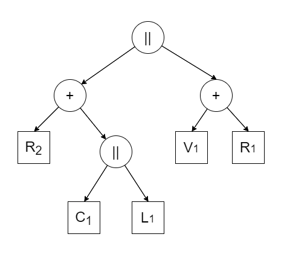

# Simple topologies
## Intro
The classical methods for circuit analysis, commonly taught in introductory electrical engineering courses, traditionally involve transforming the original system of differential equations into a system of algebraic equations. These equations are typically solved using methods such as Gaussian elimination or numerical optimization. Two well-known techniques are nodal and mesh analysis.

In specific cases where the circuit's topology can be represented as a tree-like structure of series and parallel circuits, the solution process is notably simpler and doesn't necessitate the setup of a complex equation system.

In the first part of this blog post, we explore the application of polymorphism, a fundamental concept in object-oriented programming, to exploit this simplified scenario. Subsequently, in the second part, we address the need to generalize our solution method to encompass arbitrary circuit topologies. To achieve this, we return to nodal analysis while introducing automatic differentiation to enable numerical optimization. In the final section, we discuss the advantages and implications of adopting this approach.

## Current-voltage characteristic
The central insight lies in viewing circuit elements as linear two-terminal components. Linear two-terminal component is a building block of electrical circuits having only two connection points, or terminals. It exhibits a linear relationship between voltage and current across its terminals, meaning its behavior can be described by linear equations. This perspective is crucial for two reasons. Firstly, it aligns with the nature of simple linear electrical components such as resistors, capacitors, and ideal voltage sources, all of which inherently possess two-terminal characteristics. More complex two-terminal components can be formed by combining primitive elements or other complex components in series or parallel configurations. Effectively, this approach allows us to represent a portion, or at times, an entire circuit, as a tree structure, where inner nodes symbolize series or parallel connections, and leaf nodes represent primitive components.
Secondly, linear two-terminal components can be precisely characterized by their current-voltage characteristic (CVC), which also exhibit linearity and follows a general form:

$$
aV+bI=c
$$

and thus, can be represented by a tuple $(a, b, c)$. Here, $V$ and $I$ are, in general, complex numbers representing effective voltage and current in either DC or AC mode (in DC mode imaginary part will play no role).

When describing the current-voltage relationship, it's essential to define a reference direction for both current and voltage, especially when active elements like voltage and current sources are involved. We adhere to a widely accepted rule called passive sign convention. According to this rule, the reference directions for voltage and current should be chosen so that when multiplied together to calculate power, we get a positive number for components that use up energy (like resistors) and a negative number for components that provide energy to the rest of the circuit (like voltage sources).

 

Each type of primitive component possesses its unique CVC, and we can establish rules for calculating the CVC of composite components based on their constituent elements. 

## CVC of primitive components
In Table 1, CVCs of primitive two-terminal components are shown ($\omega$ stands for angular frequency, $j$ for imaginary unit).

| Component Type | CVC |
| -- | -- |
| Resistor (R) | $V-RI=0$ |
| Capacitor (C)	| $V + j\frac{1}{\omega C}I = 0$ |
| Inductor (L) | $V - j\omega LI = 0$ |
| Impedance (Z)	| $V-ZI=0$ |
| Ideal Voltage Source (E) | $V = E$ |
| Ideal Current Source (J) | $I = J$ |

Naturally, for reactive components, impedance varies with angular velocity, meaning that CVC is, in general, not only a function of type of the component, but also of angular velocity. 

## CVC of composite components
We proceed now to understand how combining two CVCs in series and parallel circuits works, and we begin with the series connection. Here, the rule is simple: the current is the same across both components, but their voltages add up. When connecting two CVCs in series, if at least one of them is of the form $I = J$, the resulting CVC remains the same. However, in cases where neither CVC follows this form, a relationship arises between the component parameters:

$$\begin{align*}
b &= b_{1} + b_{2} \\
c &= c_{1} + c_{2}
\end{align*}$$

This elegant relationship implies that both the Thevenin equivalent impedance and voltage are obtained simply by summing the corresponding parameters.

Conversely, in parallel connections, it is voltage that is equal and currents add up. If one of the CVCs takes the form $V = E$, the resulting CVC remains unchanged. However, when one CVC is of the form $I = J$, while the other is of the form $V + b_{1}I = c_{1}$, we find the following relationships:

$$\begin{align*}
b &= b_{1}\\
c &= c_{1} + b_{1}J
\end{align*}$$

In the most general case where both CVCs are of the form $V + bI = c$, the following relationships apply:

$$\begin{align*}
b &= \frac{b_{1}b_{2}}{b_{1}+b_{2}}\\
c &= \frac{c_{1}b_{2} + c_{2}b_{1}}{b_{1}+b_{2}}
\end{align*}$$

It is important to note that both series and parallel circuits can consist of more than two components. In such cases, these formulas are iteratively combined to determine the final CVC. Below, we provide an algorithm for calculating the CVC of a series circuit:

1. Initialize `cvc` as $(1, 0, 0)$.
2. For each child node, combine `cvc` in series with CVC of the child node.
3. Return `cvc`.

The same algorithm for parallel circuits is practically identical except that `cvc` is initialized as $(0, 1, 0)$ which is a neutral element for combining in parallel. So, it is evident that to evaluate the CVC of a parent component, we rely on CVCs of its child components. Thus, the computation of CVCs goes from leaf nodes towards the root, following a post-order traversal.

## Using CVCs to simulate circuit dynamics
As noted earlier, CVC provides us with means to calculate either voltage across a two-terminal component, given its current, or vice versa. Consequently, to compute voltages and currents across the entire circuit, we must initiate the process by applying either voltage or current to the root component. The choice depends on the nature of the root:

1. Series Circuit – we apply zero voltage, effectively short-circuiting the two terminals.
2. Parallel Circuit – we apply zero current, signifying that the only connection between the terminals exists through its child components.

Once we have determined the current and voltage at the root, we can systematically propagate this information to its children, then to their children, and so forth, following a recursive pattern. Consequently, the computation of voltages and currents flows from the root towards the leaf nodes, adhering to a pre-order traversal approach.

At the end of this section, we provided an example to illustrate how a circuit can be represented as a tree, as shown in Figures 1 and 2. In this example, the reference current direction is from point B to point A.

| Circuit Scheme | Circuit tree |
|:--------------:|:-------------|
| | |

## Sketch of the implementation

In the preceding subsection, we outlined the principles of our approach which can be readily translated to a programming language that supports the object-oriented paradigm. The implementation revolves around two class hierarchies.
The foundation of our implementation is a CVC class, featuring methods like `current_at_voltage()` and `voltage_at_current()`, as well as methods for combination of two CVCs. In our implementation, the latter is done by overloading logical AND and OR operators.
To manage various circuit components, we've established a hierarchy of classes. This hierarchy adheres to the composite pattern, consisting of:

- Abstract Base Class: This base class declares critical methods such as `calc_cvc()`, `apply_current()`, `apply_voltage()`, `in_series_with()`, `in_parallel_with()`, and more. It serves as the blueprint for all component classes.
- Intermediate Abstract Classes: We've introduced an extra layer of abstract classes that categorize components into three groups:
    - Real-Valued Components: These encompass components specified by real values, including resistors, capacitors, and inductors.
    - Complex-Valued Components: This category encompasses components specified by complex values, such as impedance and ideal voltage/current sources.
    - Composite Components: These are components specified by their child components, including series and parallel circuits. The logic within these classes revolves around managing the relationships between their constituents.
- Concrete Classes: These classes represent concrete component types, encompassing both primitive and composite components. They implement the declared functions according to the unique logic associated with each component type. This ensures that specific component behaviors are accurately captured within the framework.

Python implementation can be found in this [GitHub repo](https://github.com/uros7251/PyCircuitSolver). 
